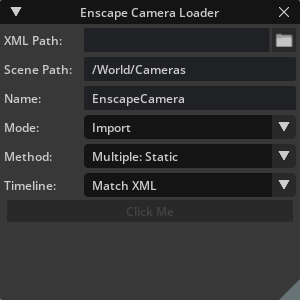

# Mead & Hunt Enscape Camera Loader


## Inspiration
`Enscape Loader` was created based on a tool I previously created, but was written from the ground up in Python for Omniverse.

## About
This tool was created as a way to exchange camera data from Enscape to Omniverse. Not all Designers/Architects may be comfortable in a tool like Omniverse so this allows them to do their work in Enscape, but bring it to Omniverse for fine tuning and advanced visualization.

## Usage
After installation the dialog can be opened from **`Window > Mead & Hunt > Enscape Camera Loader`**.



**XML Path:** Path to the XML you want to import.

**Scene Path:** `/World/Cameras (default)`Path in the Omniverse Stage where you want the Cameras to be placed.

**Name:** `EnscapeCamera` `(default)`Name to be appended by Unique number (`EnscapeCamera_01`).

**Mode:** Drop-down of what to do with the XML file.
- **`NOTE:`** Currently only `Import` is supported. A future release may support `Export`.

**Method:** Drop-down of how to process the time/keyframes for the XML data.
- `Continuous: Smooth:` Currently in development.
- `Continuous: Linear:` One camera with linear animation between all key frames.
- `Multiple: Linear:` Multiple cameras with a Linear animation between every 2 keys.
- `Multiple: Static (default):` Each keyframe comes in as a static camera.

**Timeline:** Drop-down of how to adjust the current timeline.
- `Match XML (default):` Match the timeline time to the XML.
- `Grow to Fit:` Match the last keyframe if it is greater than the current timeline.
- `Shrink to Fit:` Match the last keyframe if it is less than the current timeline.

**Click Me:** Button to process the file.

## Adding This Extension
To add this extension to your Omniverse app:
1. Go into: Extension Manager -> Gear Icon -> Extension Search Path
2. Add this as a search path: `git://github.com/ericcraft-mh/meadhunt-enscape-loader.git?branch=main&dir=exts`

## App Link Setup
If `app` folder link doesn't exist or broken it can be created again. For better developer experience it is recommended to create a folder link named `app` to the *Omniverse Kit* app installed from *Omniverse Launcher*. Convenience script to use is included.

Run:

```
> link_app.bat
```

If successful you should see `app` folder link in the root of this repo.

If multiple Omniverse apps is installed script will select recommended one. Or you can explicitly pass an app:

```
> link_app.bat --app create
```

You can also just pass a path to create link to:

```
> link_app.bat --path "C:/Users/bob/AppData/Local/ov/pkg/create-2021.3.4"
```

## Contributing
The source code for this repository is provided as-is, but I am accepting outside contributions.

Issues, Feature Requests, and Pull Requests are welcomed.

